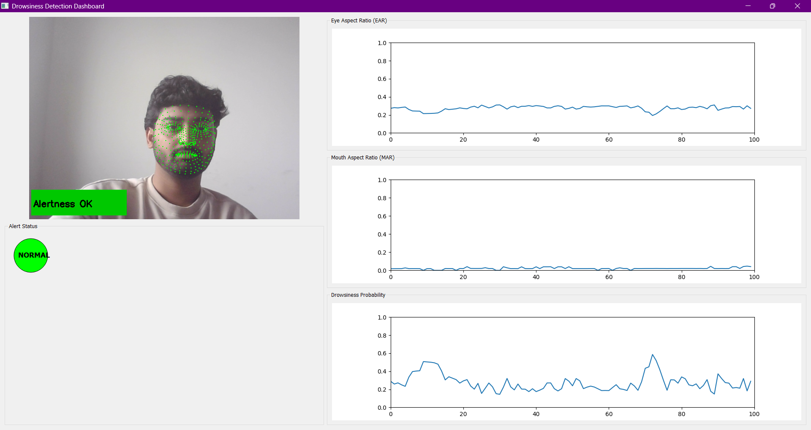
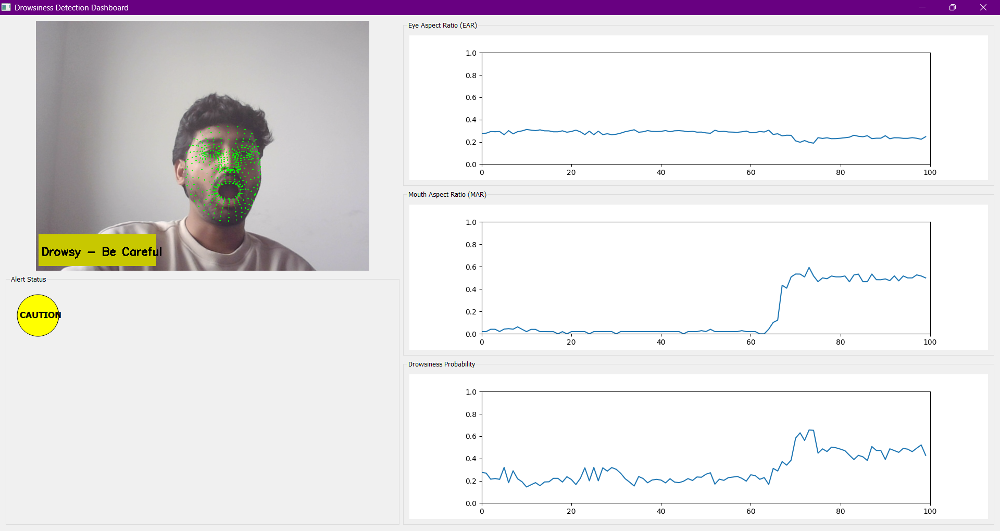
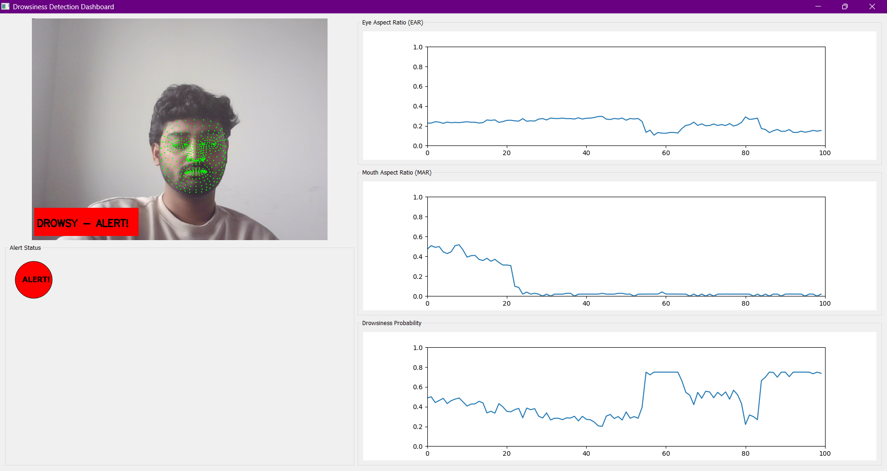
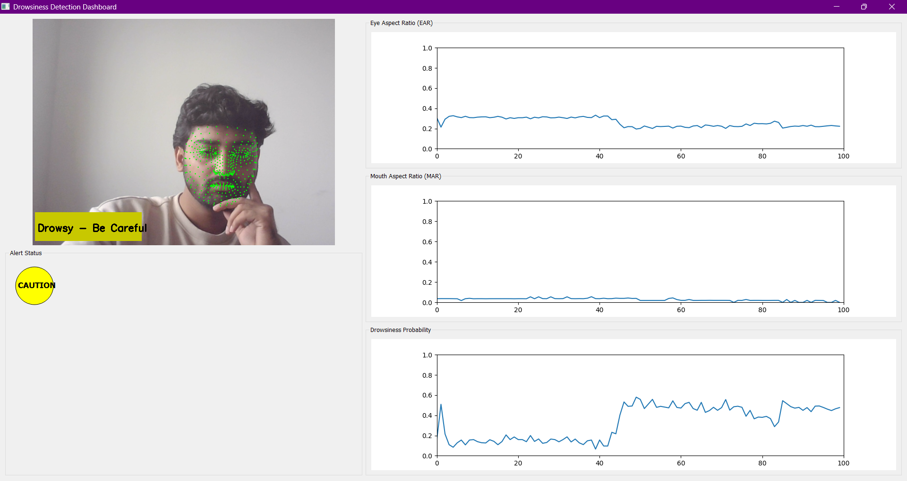

# Drowsiness Detection Dashboard

A real-time dashboard that detects drowsiness using **Eye Aspect Ratio (EAR)** and **Mouth Aspect Ratio (MAR)** with **MediaPipe Face Mesh** and PyQt5 GUI.

The dashboard:
- Captures live webcam video
- Computes EAR and MAR
- Plots real-time graphs
- Calculates drowsiness probability with color-coded alerts
- Triggers sound warnings when the user appears drowsy

---

## Features

- Real-time facial landmark detection using **MediaPipe**
- Adaptive **Drowsiness Probability** calculation
- **Graphical interface** with PyQt5
- **Color-coded alerts**: Green (Normal), Yellow (Caution), Red (Alert)
- Plays a **beep sound** when drowsiness is detected
- Visual landmarks (dots) displayed on the face

---

Images

Green – Alertness OK


Yellow – Drowsy / Be careful


Red – Drowsy / Alert


Yellow – Drowsy / Be careful

## Installation

1. Clone the repository:

git clone https://github.com/vinitrajsoni/DrownessDetectionDashboardLiveCapture.git
cd drawness_detection
or download the file


2. set up enviroment:
   create a virtual enviroment so you don't have to install in C drive direct download for virtual enivroment
   
## Installation

### Create a virtual environment (optional but recommended):

```bash
python -m venv .venv
# Windows
.venv\Scripts\activate
# Linux/Mac
source .venv/bin/activate

3. Downlaod libraries that needed
   pip install -r requirements.txt
it will download all the libraries that needed

4. Run the application using command
   python main.py


